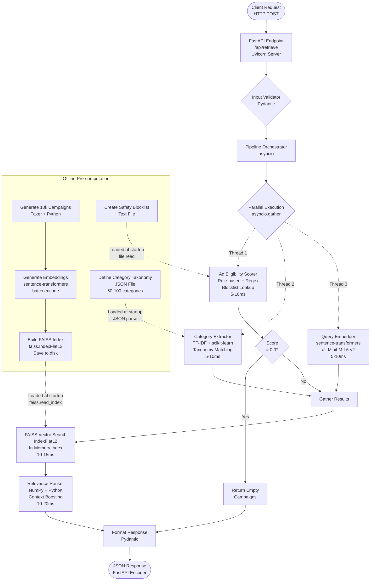
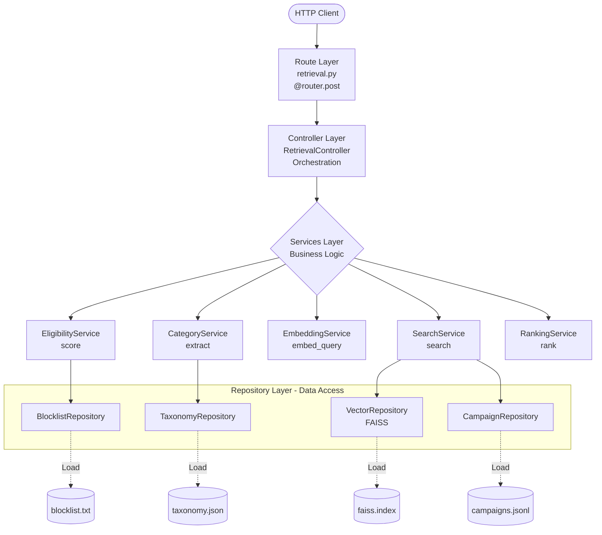

# Ad Retrieval System - Technical Development Plan

## Architecture Overview




**Key Technologies by Component:**


| Component               | Technology                   | Purpose                                  |
| ----------------------- | ---------------------------- | ---------------------------------------- |
| **API Framework**       | FastAPI + Uvicorn            | High-performance async HTTP server       |
| **Validation**          | Pydantic                     | Request/response schema validation       |
| **Async Orchestration** | asyncio                      | Parallel execution of independent tasks  |
| **Eligibility Scoring** | Python regex + set lookups   | Fast rule-based classification           |
| **Category Extraction** | scikit-learn TfidfVectorizer | Keyword matching against taxonomy        |
| **Embeddings**          | sentence-transformers        | Local model inference (all-MiniLM-L6-v2) |
| **Vector Search**       | FAISS IndexFlatL2            | In-memory similarity search              |
| **Ranking**             | NumPy + Python               | Score computation and sorting            |
| **Data Generation**     | Faker                        | Synthetic campaign creation              |
| **Storage**             | JSON Lines + NumPy files     | Campaign data and embeddings             |


**Key Flow:**

1. Request arrives at FastAPI endpoint (Uvicorn)
2. Pydantic validates input schema
3. asyncio orchestrates three parallel operations: eligibility (regex), categories (TF-IDF), embedding (sentence-transformers)
4. If eligibility = 0.0, short-circuit and return empty campaigns
5. Otherwise, perform FAISS vector search on pre-loaded index
6. Rank results using NumPy operations with context-based boosting
7. Return top 1,000 campaigns (or fewer if less available)

**Latency Breakdown:** 50-70ms server-side (30ms buffer for 100ms end-to-end target)

## Technology Stack

**Core Framework:**

- FastAPI (async, high-performance, sub-ms overhead)
- Python 3.11+ (performance improvements)
- uvicorn with multiple workers

**Embedding & Search:**

- sentence-transformers (`all-MiniLM-L6-v2` - 384 dims, ~5ms inference)
- FAISS (Facebook AI Similarity Search - in-memory, <10ms for 10k vectors)
- NumPy for vector operations

**Ad Eligibility:**

- Rule-based classifier with keyword blocklist (harmful content, NSFW, violence)
- Lightweight sentiment analysis for edge cases
- Pre-compiled regex patterns for speed

**Category Extraction:**

- Pre-defined taxonomy (50-100 categories across verticals)
- TF-IDF + keyword matching for fast extraction
- Fallback to embedding similarity if needed

**Data Generation:**

- Faker library for synthetic campaigns
- Diverse verticals: retail, travel, fitness, tech, finance, health, education, automotive
- Structured schema with targeting metadata

## Latency Budget (100ms end-to-end)


| Component              | Target      | Strategy                                     |
| ---------------------- | ----------- | -------------------------------------------- |
| Network overhead       | ~10-20ms    | (uncontrollable, leaves 80-90ms server-side) |
| Input validation       | <1ms        | Pydantic models                              |
| Ad eligibility         | 5-10ms      | Rule-based + blocklist lookup                |
| Category extraction    | 5-10ms      | TF-IDF + keyword matching                    |
| Query embedding        | 5-10ms      | Local sentence-transformer                   |
| Vector search (FAISS)  | 10-15ms     | In-memory index, k=1000                      |
| Relevance ranking      | 10-20ms     | Combine semantic + context signals           |
| Response serialization | <5ms        | FastAPI JSON encoder                         |
| **Total server-side**  | **50-70ms** | Leaves 20-30ms buffer                        |


**Optimization techniques:**

- Parallel execution of eligibility + categories + embedding (asyncio)
- Pre-load all models and indexes on startup
- Warm-up requests to JIT compile hot paths
- Short-circuit when ad_eligibility = 0.0 (skip retrieval)
- Batch operations where possible

## Implementation Phases

### Phase 1: Project Setup & Synthetic Data (4-6 hours)

**1.1 Project Structure (RCSR Architecture)**

```
gravity/
├── src/
│   ├── api/
│   │   ├── __init__.py
│   │   ├── main.py              # FastAPI app initialization
│   │   ├── routes/              # ROUTES LAYER
│   │   │   ├── __init__.py
│   │   │   └── retrieval.py     # /api/retrieve endpoint definition
│   │   └── models/              # Request/Response DTOs
│   │       ├── __init__.py
│   │       ├── requests.py      # RetrievalRequest, UserContext
│   │       └── responses.py     # RetrievalResponse, Campaign
│   ├── controllers/             # CONTROLLERS LAYER
│   │   ├── __init__.py
│   │   └── retrieval_controller.py  # Orchestrates service calls
│   ├── services/                # SERVICES LAYER (Business Logic)
│   │   ├── __init__.py
│   │   ├── eligibility_service.py   # Ad eligibility scoring
│   │   ├── category_service.py      # Category extraction
│   │   ├── embedding_service.py     # Query embedding
│   │   ├── search_service.py        # Campaign search
│   │   └── ranking_service.py       # Relevance ranking
│   ├── repositories/            # REPOSITORIES LAYER (Data Access)
│   │   ├── __init__.py
│   │   ├── campaign_repository.py   # Campaign data access
│   │   ├── vector_repository.py     # FAISS index access
│   │   ├── blocklist_repository.py  # Blocklist data access
│   │   └── taxonomy_repository.py   # Taxonomy data access
│   ├── core/
│   │   ├── __init__.py
│   │   ├── config.py            # Settings, paths, constants
│   │   └── dependencies.py      # Dependency injection setup
│   └── utils/
│       ├── __init__.py
│       └── timing.py            # Latency tracking utilities
├── data/
│   ├── campaigns.jsonl          # Generated campaigns (10k+)
│   ├── embeddings.npy           # Pre-computed embeddings
│   ├── faiss.index              # FAISS index file
│   ├── blocklist.txt            # Safety blocklist
│   └── taxonomy.json            # Category taxonomy
├── tests/
│   ├── unit/
│   │   ├── test_services.py
│   │   └── test_repositories.py
│   ├── integration/
│   │   ├── test_controller.py
│   │   └── test_api.py
│   └── fixtures/
│       └── test_queries.json    # 10+ test cases
├── scripts/
│   ├── generate_data.py         # Run data generation
│   ├── build_index.py           # Build FAISS index
│   └── benchmark.py             # Latency testing
├── requirements.txt
├── README.md
└── .env
```

**RCSR Layer Responsibilities:**


| Layer            | Responsibility                                       | Example                                                    |
| ---------------- | ---------------------------------------------------- | ---------------------------------------------------------- |
| **Routes**       | HTTP endpoint definitions, request/response handling | `@router.post("/api/retrieve")`                            |
| **Controllers**  | Orchestrate service calls, handle business flow      | Parallel execution of eligibility + categories + embedding |
| **Services**     | Business logic, single responsibility                | EligibilityService.score(), CategoryService.extract()      |
| **Repositories** | Data access, external system interaction             | VectorRepository.search(), CampaignRepository.get_by_ids() |


**RCSR Architecture Diagram:**




**Data Flow:**

1. **Route** receives HTTP request, validates with Pydantic
2. **Controller** orchestrates parallel service calls
3. **Services** execute business logic (scoring, extraction, embedding, search, ranking)
4. **Repositories** provide data access (FAISS, campaigns, blocklist, taxonomy)
5. **Controller** aggregates results and returns response via **Route**

**1.2 Synthetic Campaign Generator (`src/data/generator.py`)**

Generate 10,000+ campaigns with schema:

```python
{
    "campaign_id": "camp_00001",
    "title": "Nike Air Zoom Pegasus - Marathon Running Shoes",
    "description": "Lightweight running shoes designed for marathon training...",
    "category": "running_shoes",
    "subcategories": ["athletic_footwear", "marathon_gear"],
    "keywords": ["running", "marathon", "shoes", "athletic", "training"],
    "targeting": {
        "age_min": 18,
        "age_max": 45,
        "genders": ["male", "female"],
        "locations": ["US", "CA"],
        "interests": ["fitness", "running", "sports"]
    },
    "vertical": "retail_fitness",
    "budget": 50000,
    "cpc": 2.50
}
```

**Verticals to cover (1,000-1,500 campaigns each):**

- Retail (fashion, electronics, home goods)
- Fitness & Sports
- Travel & Hospitality
- Automotive
- Finance (credit cards, loans, insurance)
- Health & Wellness
- Education & Courses
- Technology & Software

**Generation approach:**

- Use Faker + templates for realistic content
- Ensure keyword diversity for semantic matching
- Add targeting metadata for context-based ranking
- Deterministic seed for reproducibility

### Phase 2: Core API & RCSR Setup (2-3 hours)

**2.1 FastAPI App (`src/api/main.py`)**

```python
from fastapi import FastAPI
from fastapi.middleware.cors import CORSMiddleware
from src.api.routes import retrieval
from src.core.dependencies import init_dependencies
import time

app = FastAPI(title="Ad Retrieval API")

app.add_middleware(CORSMiddleware, allow_origins=["*"])

@app.on_event("startup")
async def startup_event():
    # Initialize all repositories (load data into memory)
    await init_dependencies()

@app.middleware("http")
async def add_latency_header(request, call_next):
    start = time.perf_counter()
    response = await call_next(request)
    latency = (time.perf_counter() - start) * 1000
    response.headers["X-Latency-Ms"] = str(latency)
    return response

# Register routes
app.include_router(retrieval.router, prefix="/api", tags=["retrieval"])
```

**2.2 Request Models (`src/api/models/requests.py`)**

```python
from pydantic import BaseModel, Field
from typing import List, Optional

class UserContext(BaseModel):
    gender: Optional[str] = None
    age: Optional[int] = None
    location: Optional[str] = None
    interests: Optional[List[str]] = None

class RetrievalRequest(BaseModel):
    query: str = Field(..., min_length=1, max_length=500)
    context: Optional[UserContext] = None
```

**2.3 Response Models (`src/api/models/responses.py`)**

```python
from pydantic import BaseModel, Field
from typing import List, Dict

class Campaign(BaseModel):
    campaign_id: str
    relevance_score: float
    title: str
    category: str
    description: str
    keywords: List[str]

class RetrievalResponse(BaseModel):
    ad_eligibility: float = Field(..., ge=0.0, le=1.0)
    extracted_categories: List[str] = Field(..., min_items=1, max_items=10)
    campaigns: List[Campaign]
    latency_ms: float
    metadata: Dict = {}
```

**2.4 Route Definition (`src/api/routes/retrieval.py`)**

```python
from fastapi import APIRouter, Depends
from src.api.models.requests import RetrievalRequest
from src.api.models.responses import RetrievalResponse
from src.controllers.retrieval_controller import RetrievalController
from src.core.dependencies import get_retrieval_controller

router = APIRouter()

@router.post("/retrieve", response_model=RetrievalResponse)
async def retrieve_ads(
    request: RetrievalRequest,
    controller: RetrievalController = Depends(get_retrieval_controller)
) -> RetrievalResponse:
    """
    Retrieve relevant ad campaigns for a given query.
    
    - Scores ad eligibility (0.0-1.0)
    - Extracts relevant categories (1-10)
    - Returns top 1000 campaigns by relevance
    - Target latency: <100ms end-to-end
    """
    return await controller.retrieve(request)
```

### Phase 3: Services Layer - Eligibility (3-4 hours)

**3.1 Eligibility Service (`src/services/eligibility_service.py`)**

```python
from typing import Optional
from src.repositories.blocklist_repository import BlocklistRepository

class EligibilityService:
    """
    SERVICE: Business logic for ad eligibility scoring.
    Determines if it's appropriate to show ads for a query (0.0-1.0).
    """
    
    def __init__(self, blocklist_repo: BlocklistRepository):
        self.blocklist_repo = blocklist_repo
        self.sensitive_patterns = self._compile_patterns()
        self.commercial_patterns = self._compile_commercial_patterns()
    
    async def score(self, query: str, context: Optional[dict] = None) -> float:
        """
        Score query eligibility for ads.
        
        Returns:
            0.0 = Do not show ads (harmful/inappropriate)
            0.4-0.7 = Sensitive context
            0.8-1.0 = Appropriate for ads
        """
        query_lower = query.lower()
        
        # Check blocklist (0.0 cases)
        if self.blocklist_repo.contains_blocked_content(query_lower):
            return 0.0
        
        # Check sensitive topics (0.3-0.5)
        if self._is_sensitive(query_lower):
            return 0.4
        
        # Check commercial intent signals (0.8-1.0)
        if self._has_commercial_intent(query_lower):
            return 0.95
        
        # Default informational (0.7-0.85)
        return 0.75
    
    def _is_sensitive(self, query: str) -> bool:
        # Financial distress, grief, mental health crises
        return any(pattern.search(query) for pattern in self.sensitive_patterns)
    
    def _has_commercial_intent(self, query: str) -> bool:
        # "buy", "best", "review", "price", etc.
        return any(pattern.search(query) for pattern in self.commercial_patterns)
    
    def _compile_patterns(self):
        # Compile regex patterns for sensitive content
        import re
        return [
            re.compile(r'\b(bankruptcy|unemployed|fired|laid off)\b'),
            re.compile(r'\b(passed away|died|funeral|grief)\b'),
            re.compile(r'\b(depressed|anxious|panic attack)\b'),
        ]
    
    def _compile_commercial_patterns(self):
        import re
        return [
            re.compile(r'\b(buy|purchase|shop|order)\b'),
            re.compile(r'\b(best|top|review|compare)\b'),
            re.compile(r'\b(price|cost|cheap|deal)\b'),
        ]
```

**3.2 Blocklist Repository (`src/repositories/blocklist_repository.py`)**

```python
from typing import Set

class BlocklistRepository:
    """
    REPOSITORY: Data access for safety blocklist.
    """
    
    def __init__(self, blocklist_path: str):
        self.blocked_terms: Set[str] = set()
        self.blocked_patterns = []
        self._load_blocklist(blocklist_path)
    
    def _load_blocklist(self, path: str):
        """Load blocklist from file."""
        import re
        with open(path, 'r') as f:
            for line in f:
                term = line.strip().lower()
                if term:
                    self.blocked_terms.add(term)
                    # Also compile as pattern for partial matching
                    self.blocked_patterns.append(re.compile(rf'\b{re.escape(term)}\b'))
    
    def contains_blocked_content(self, query: str) -> bool:
        """Check if query contains blocked content."""
        query_lower = query.lower()
        
        # Exact term match
        if any(term in query_lower for term in self.blocked_terms):
            return True
        
        # Pattern match
        if any(pattern.search(query_lower) for pattern in self.blocked_patterns):
            return True
        
        return False
```

**3.3 Blocklist Data (`data/blocklist.txt`)**

```
# Self-harm and violence
suicide
kill myself
self harm
how to die

# Explicit content
porn
xxx
nsfw

# Hate speech
[racial slurs]
[hate terms]

# Illegal activities
make bomb
buy drugs

# Medical emergencies
heart attack help
overdose symptoms
```

### Phase 4: Services Layer - Categories (2-3 hours)

**4.1 Category Service (`src/services/category_service.py`)**

```python
from typing import List, Optional
from sklearn.feature_extraction.text import TfidfVectorizer
from src.repositories.taxonomy_repository import TaxonomyRepository

class CategoryService:
    """
    SERVICE: Business logic for category extraction.
    Extracts 1-10 relevant product/service categories from query.
    """
    
    def __init__(self, taxonomy_repo: TaxonomyRepository):
        self.taxonomy_repo = taxonomy_repo
        self.vectorizer = TfidfVectorizer(max_features=100, ngram_range=(1, 3))
        self._fit_vectorizer()
    
    def _fit_vectorizer(self):
        """Pre-fit TF-IDF on taxonomy keywords."""
        all_keywords = []
        for category_data in self.taxonomy_repo.get_all_categories().values():
            all_keywords.extend(category_data['keywords'])
        self.vectorizer.fit(all_keywords)
    
    async def extract(
        self, 
        query: str, 
        context: Optional[dict] = None, 
        max_categories: int = 10
    ) -> List[str]:
        """
        Extract relevant categories from query.
        
        Returns: 1-10 category names (enforced)
        """
        # Score all categories by keyword similarity
        scores = self._score_categories(query)
        
        # Boost categories matching context interests
        if context and context.get("interests"):
            scores = self._boost_by_interests(scores, context["interests"])
        
        # Select top N categories
        categories = self._select_top_n(scores, max_categories)
        
        # Enforce 1-10 range
        if len(categories) == 0:
            return ["general"]  # Fallback
        
        return categories[:10]
    
    def _score_categories(self, query: str) -> dict:
        """Score each category by keyword match."""
        scores = {}
        query_lower = query.lower()
        
        for category_name, category_data in self.taxonomy_repo.get_all_categories().items():
            score = 0.0
            
            # Exact keyword matches
            for keyword in category_data['keywords']:
                if keyword.lower() in query_lower:
                    score += 1.0
            
            # Partial matches (TF-IDF similarity)
            # ... (simplified for brevity)
            
            scores[category_name] = score
        
        return scores
    
    def _boost_by_interests(self, scores: dict, interests: List[str]) -> dict:
        """Boost categories that align with user interests."""
        for category_name in scores:
            category_data = self.taxonomy_repo.get_category(category_name)
            if any(interest.lower() in category_data.get('related', []) for interest in interests):
                scores[category_name] *= 1.5
        return scores
    
    def _select_top_n(self, scores: dict, n: int) -> List[str]:
        """Select top N categories by score."""
        sorted_categories = sorted(scores.items(), key=lambda x: x[1], reverse=True)
        return [cat for cat, score in sorted_categories[:n] if score > 0]
```

**4.2 Taxonomy Repository (`src/repositories/taxonomy_repository.py`)**

```python
import json
from typing import Dict

class TaxonomyRepository:
    """
    REPOSITORY: Data access for category taxonomy.
    """
    
    def __init__(self, taxonomy_path: str):
        self.taxonomy: Dict = {}
        self._load_taxonomy(taxonomy_path)
    
    def _load_taxonomy(self, path: str):
        """Load taxonomy from JSON file."""
        with open(path, 'r') as f:
            self.taxonomy = json.load(f)
    
    def get_all_categories(self) -> Dict:
        """Get all categories."""
        return self.taxonomy
    
    def get_category(self, category_name: str) -> Dict:
        """Get specific category data."""
        return self.taxonomy.get(category_name, {})
```

**4.3 Taxonomy Data (`data/taxonomy.json`)**

```json
{
  "running_shoes": {
    "keywords": ["running shoes", "marathon shoes", "jogging footwear", "running sneakers"],
    "related": ["fitness", "running", "sports"]
  },
  "athletic_footwear": {
    "keywords": ["athletic shoes", "sports shoes", "training shoes", "gym shoes"],
    "related": ["fitness", "sports", "gym"]
  },
  "marathon_gear": {
    "keywords": ["marathon gear", "marathon training", "race preparation"],
    "related": ["running", "fitness", "sports"]
  },
  "fitness_trackers": {
    "keywords": ["fitness tracker", "smartwatch", "activity monitor", "step counter"],
    "related": ["fitness", "technology", "health"]
  }
}
```

### Phase 5: Services Layer - Embedding & Search (4-6 hours)

**5.1 Embedding Service (`src/services/embedding_service.py`)**

```python
from typing import List
import numpy as np
from sentence_transformers import SentenceTransformer

class EmbeddingService:
    """
    SERVICE: Business logic for text embedding.
    Converts queries and campaigns to vector representations.
    """
    
    def __init__(self):
        # Fast, lightweight model: 384 dims, ~5ms inference
        self.model = SentenceTransformer('all-MiniLM-L6-v2')
    
    async def embed_query(self, query: str, categories: List[str]) -> np.ndarray:
        """
        Embed query text combined with extracted categories.
        
        Returns: 384-dimensional vector
        """
        # Combine query + categories for richer embedding
        text = f"{query} {' '.join(categories)}"
        return self.model.encode(text, convert_to_numpy=True)
    
    def embed_campaigns_batch(self, campaigns: List[dict]) -> np.ndarray:
        """
        Batch embed campaigns (used offline for index building).
        
        Returns: (N, 384) array of embeddings
        """
        texts = [
            f"{c['title']} {c['description']} {' '.join(c['keywords'])}"
            for c in campaigns
        ]
        return self.model.encode(texts, convert_to_numpy=True, show_progress_bar=True)
```

**5.2 Search Service (`src/services/search_service.py`)**

```python
from typing import List
import numpy as np
from src.repositories.vector_repository import VectorRepository
from src.repositories.campaign_repository import CampaignRepository

class SearchService:
    """
    SERVICE: Business logic for campaign search.
    Performs vector similarity search and retrieves campaign data.
    """
    
    def __init__(
        self, 
        vector_repo: VectorRepository,
        campaign_repo: CampaignRepository
    ):
        self.vector_repo = vector_repo
        self.campaign_repo = campaign_repo
    
    async def search(
        self, 
        query_embedding: np.ndarray, 
        k: int = 1000
    ) -> List[dict]:
        """
        Search for top-k most similar campaigns.
        
        Returns: List of campaigns with similarity_score
        """
        # Vector search: ~10ms for 10k vectors
        indices, distances = self.vector_repo.search(query_embedding, k)
        
        # Retrieve campaign data
        campaigns = self.campaign_repo.get_by_indices(indices)
        
        # Attach similarity scores
        for i, campaign in enumerate(campaigns):
            # Convert L2 distance to similarity score (0-1)
            campaign['similarity_score'] = float(1 / (1 + distances[i]))
        
        return campaigns
```

**5.3 Vector Repository (`src/repositories/vector_repository.py`)**

```python
import faiss
import numpy as np
from typing import Tuple

class VectorRepository:
    """
    REPOSITORY: Data access for FAISS vector index.
    """
    
    def __init__(self, index_path: str):
        self.index = None
        self._load_index(index_path)
    
    def _load_index(self, path: str):
        """Load FAISS index from disk."""
        self.index = faiss.read_index(path)
        print(f"Loaded FAISS index with {self.index.ntotal} vectors")
    
    def search(self, query_embedding: np.ndarray, k: int) -> Tuple[np.ndarray, np.ndarray]:
        """
        Search for k nearest neighbors.
        
        Returns: (indices, distances) arrays
        """
        # Ensure query is 2D (1, D)
        if query_embedding.ndim == 1:
            query_embedding = query_embedding.reshape(1, -1)
        
        # FAISS search
        distances, indices = self.index.search(query_embedding, k)
        
        return indices[0], distances[0]
```

**5.4 Campaign Repository (`src/repositories/campaign_repository.py`)**

```python
import json
from typing import List
import numpy as np

class CampaignRepository:
    """
    REPOSITORY: Data access for campaign metadata.
    """
    
    def __init__(self, campaigns_path: str):
        self.campaigns: List[dict] = []
        self._load_campaigns(campaigns_path)
    
    def _load_campaigns(self, path: str):
        """Load campaigns from JSONL file."""
        with open(path, 'r') as f:
            for line in f:
                self.campaigns.append(json.loads(line))
        print(f"Loaded {len(self.campaigns)} campaigns")
    
    def get_by_indices(self, indices: np.ndarray) -> List[dict]:
        """Get campaigns by index array."""
        return [self.campaigns[idx].copy() for idx in indices]
    
    def get_all(self) -> List[dict]:
        """Get all campaigns."""
        return self.campaigns
```

**5.3 Index Building (offline script)**

```python
# scripts/build_index.py
def build_faiss_index():
    campaigns = load_campaigns("data/campaigns.jsonl")
    embedder = QueryEmbedder()
    
    # Generate embeddings
    embeddings = embedder.embed_campaigns(campaigns)
    np.save("data/embeddings.npy", embeddings)
    
    # Build FAISS index (L2 distance, flat for <100k vectors)
    dimension = embeddings.shape[1]
    index = faiss.IndexFlatL2(dimension)
    index.add(embeddings)
    
    faiss.write_index(index, "data/faiss.index")
```

### Phase 6: Services Layer - Ranking (3-4 hours)

**6.1 Ranking Service (`src/services/ranking_service.py`)**

```python
from typing import List, Optional

class RankingService:
    """
    SERVICE: Business logic for relevance ranking.
    Combines semantic similarity with context-based signals.
    """
    
    def __init__(self):
        pass
    
    async def rank(
        self, 
        campaigns: List[dict], 
        query: str, 
        categories: List[str],
        context: Optional[dict] = None
    ) -> List[dict]:
        """
        Rank campaigns by relevance.
        
        Combines:
        - Semantic similarity (from vector search)
        - Category matching
        - Context-based targeting (age, location, interests)
        
        Returns: Sorted list of campaigns with relevance_score
        """
        for campaign in campaigns:
            # Base score from semantic similarity
            score = campaign['similarity_score']
            
            # Boost if campaign category matches extracted categories
            if campaign['category'] in categories:
                score *= 1.3
            
            # Boost for subcategory matches
            if any(subcat in categories for subcat in campaign.get('subcategories', [])):
                score *= 1.15
            
            # Context-based boosts
            if context:
                score = self._apply_context_boosts(campaign, context, score)
            
            # Normalize to 0-1 range
            campaign['relevance_score'] = min(score, 1.0)
        
        # Sort by relevance (descending)
        campaigns.sort(key=lambda x: x['relevance_score'], reverse=True)
        return campaigns
    
    def _apply_context_boosts(
        self, 
        campaign: dict, 
        context: dict, 
        base_score: float
    ) -> float:
        """Apply context-based ranking boosts."""
        score = base_score
        targeting = campaign.get('targeting', {})
        
        # Age targeting
        if context.get('age') and targeting.get('age_min') and targeting.get('age_max'):
            age = context['age']
            if targeting['age_min'] <= age <= targeting['age_max']:
                score *= 1.1
        
        # Gender targeting
        if context.get('gender') and targeting.get('genders'):
            if context['gender'] in targeting['genders']:
                score *= 1.05
        
        # Location targeting
        if context.get('location') and targeting.get('locations'):
            # Simple country/state matching
            location_parts = context['location'].split(',')
            if any(loc.strip() in targeting['locations'] for loc in location_parts):
                score *= 1.15
        
        # Interest alignment
        if context.get('interests') and targeting.get('interests'):
            interest_overlap = len(
                set(context['interests']) & set(targeting['interests'])
            )
            score *= (1 + 0.1 * interest_overlap)
        
        return score
```

### Phase 7: Controller Layer - Orchestration (2-3 hours)

**7.1 Retrieval Controller (`src/controllers/retrieval_controller.py`)**

```python
import asyncio
import time
from typing import Optional
from src.api.models.requests import RetrievalRequest
from src.api.models.responses import RetrievalResponse, Campaign
from src.services.eligibility_service import EligibilityService
from src.services.category_service import CategoryService
from src.services.embedding_service import EmbeddingService
from src.services.search_service import SearchService
from src.services.ranking_service import RankingService

class RetrievalController:
    """
    CONTROLLER: Orchestrates service calls for ad retrieval.
    Handles business flow and parallel execution.
    """
    
    def __init__(
        self,
        eligibility_service: EligibilityService,
        category_service: CategoryService,
        embedding_service: EmbeddingService,
        search_service: SearchService,
        ranking_service: RankingService
    ):
        self.eligibility_service = eligibility_service
        self.category_service = category_service
        self.embedding_service = embedding_service
        self.search_service = search_service
        self.ranking_service = ranking_service
    
    async def retrieve(self, request: RetrievalRequest) -> RetrievalResponse:
        """
        Main retrieval flow.
        
        1. Parallel: eligibility + categories
        2. Short-circuit if eligibility = 0.0
        3. Embed query
        4. Search campaigns
        5. Rank by relevance
        6. Return top 1000
        """
        start_time = time.perf_counter()
        
        # Phase 1: Parallel processing (30-40ms)
        eligibility_task = self.eligibility_service.score(
            request.query, 
            request.context.dict() if request.context else None
        )
        categories_task = self.category_service.extract(
            request.query,
            request.context.dict() if request.context else None
        )
        
        eligibility, categories = await asyncio.gather(
            eligibility_task, 
            categories_task
        )
        
        # Short-circuit if ad_eligibility is 0.0
        if eligibility == 0.0:
            latency_ms = (time.perf_counter() - start_time) * 1000
            return RetrievalResponse(
                ad_eligibility=0.0,
                extracted_categories=categories,
                campaigns=[],
                latency_ms=latency_ms,
                metadata={"short_circuited": True}
            )
        
        # Phase 2: Embedding + Search (40-50ms)
        query_embedding = await self.embedding_service.embed_query(
            request.query, 
            categories
        )
        candidates = await self.search_service.search(
            query_embedding, 
            k=1500  # Retrieve more than 1000 for ranking
        )
        
        # Phase 3: Ranking (10-20ms)
        ranked_campaigns = await self.ranking_service.rank(
            candidates,
            request.query,
            categories,
            request.context.dict() if request.context else None
        )
        
        # Return top 1000 (or fewer if less available)
        final_campaigns = ranked_campaigns[:1000]
        
        latency_ms = (time.perf_counter() - start_time) * 1000
        
        # Convert to response models
        campaign_models = [
            Campaign(
                campaign_id=c['campaign_id'],
                relevance_score=c['relevance_score'],
                title=c['title'],
                category=c['category'],
                description=c['description'],
                keywords=c['keywords']
            )
            for c in final_campaigns
        ]
        
        return RetrievalResponse(
            ad_eligibility=eligibility,
            extracted_categories=categories,
            campaigns=campaign_models,
            latency_ms=latency_ms,
            metadata={
                "candidates_retrieved": len(candidates),
                "campaigns_returned": len(campaign_models)
            }
        )
```

**7.2 Dependency Injection (`src/core/dependencies.py`)**

```python
from functools import lru_cache
from src.controllers.retrieval_controller import RetrievalController
from src.services.eligibility_service import EligibilityService
from src.services.category_service import CategoryService
from src.services.embedding_service import EmbeddingService
from src.services.search_service import SearchService
from src.services.ranking_service import RankingService
from src.repositories.blocklist_repository import BlocklistRepository
from src.repositories.taxonomy_repository import TaxonomyRepository
from src.repositories.vector_repository import VectorRepository
from src.repositories.campaign_repository import CampaignRepository
from src.core.config import settings

# Singleton repositories (loaded once at startup)
_blocklist_repo = None
_taxonomy_repo = None
_vector_repo = None
_campaign_repo = None

async def init_dependencies():
    """Initialize all repositories at startup."""
    global _blocklist_repo, _taxonomy_repo, _vector_repo, _campaign_repo
    
    _blocklist_repo = BlocklistRepository(settings.BLOCKLIST_PATH)
    _taxonomy_repo = TaxonomyRepository(settings.TAXONOMY_PATH)
    _vector_repo = VectorRepository(settings.FAISS_INDEX_PATH)
    _campaign_repo = CampaignRepository(settings.CAMPAIGNS_PATH)
    
    print("All repositories initialized")

@lru_cache()
def get_retrieval_controller() -> RetrievalController:
    """Dependency injection for controller."""
    
    # Services
    eligibility_service = EligibilityService(_blocklist_repo)
    category_service = CategoryService(_taxonomy_repo)
    embedding_service = EmbeddingService()
    search_service = SearchService(_vector_repo, _campaign_repo)
    ranking_service = RankingService()
    
    # Controller
    return RetrievalController(
        eligibility_service,
        category_service,
        embedding_service,
        search_service,
        ranking_service
    )
```

**7.3 Configuration (`src/core/config.py`)**

```python
from pydantic_settings import BaseSettings

class Settings(BaseSettings):
    # Paths
    DATA_DIR: str = "data"
    CAMPAIGNS_PATH: str = "data/campaigns.jsonl"
    EMBEDDINGS_PATH: str = "data/embeddings.npy"
    FAISS_INDEX_PATH: str = "data/faiss.index"
    BLOCKLIST_PATH: str = "data/blocklist.txt"
    TAXONOMY_PATH: str = "data/taxonomy.json"
    
    # Model settings
    EMBEDDING_MODEL: str = "all-MiniLM-L6-v2"
    
    # Search settings
    TOP_K_CANDIDATES: int = 1500
    MAX_CAMPAIGNS_RETURNED: int = 1000
    
    class Config:
        env_file = ".env"

settings = Settings()
```

### Phase 8: Testing & Benchmarking (2-3 hours)

**8.1 Test Queries (`tests/test_queries.json`)**

Create 10+ diverse test cases:

```json
[
  {
    "query": "I'm running a marathon next month and need new shoes",
    "context": {"gender": "male", "age": 24, "location": "San Francisco, CA", "interests": ["fitness"]},
    "expected_eligibility": ">0.9",
    "expected_categories": ["running_shoes", "marathon_gear", "athletic_footwear"]
  },
  {
    "query": "My mom just passed away",
    "context": {},
    "expected_eligibility": "0.0",
    "expected_categories": [],
    "expected_campaigns": 0
  },
  {
    "query": "What is the history of the marathon?",
    "context": {},
    "expected_eligibility": "0.8-0.9",
    "expected_categories": ["marathon_gear", "running_shoes", "sports_history"]
  }
]
```

**8.2 Benchmark Script (`scripts/benchmark.py`)**

```python
import requests
import statistics

def benchmark_latency(test_queries: List[dict], n_runs: int = 100):
    latencies = []
    
    for _ in range(n_runs):
        for test in test_queries:
            response = requests.post(
                "http://localhost:8000/api/retrieve",
                json={"query": test["query"], "context": test.get("context")}
            )
            latencies.append(response.json()["latency_ms"])
    
    print(f"Mean: {statistics.mean(latencies):.2f}ms")
    print(f"P50: {statistics.median(latencies):.2f}ms")
    print(f"P95: {statistics.quantiles(latencies, n=20)[18]:.2f}ms")
    print(f"P99: {statistics.quantiles(latencies, n=100)[98]:.2f}ms")
```

### Phase 9: Documentation & Deployment (2-3 hours)

**9.1 README.md**

Include:

- Setup instructions (Python version, dependencies)
- Quick start guide
- Architecture overview (reference diagram)
- Latency breakdown table
- Design decisions and trade-offs
- Test query examples with results
- API documentation

**9.2 Deployment Considerations**

For Railway or similar:

- Use gunicorn/uvicorn with 2-4 workers
- Set worker timeout to 120s
- Pre-load models on startup (add warmup endpoint)
- Monitor memory usage (embeddings + FAISS ~500MB-1GB)
- Add health check endpoint

## Key Design Decisions & Trade-offs

### 1. Local Models vs. API Calls

**Decision:** Use local sentence-transformers model  
**Rationale:** API calls (OpenRouter, OpenAI) add 50-200ms latency + network variability. Local inference with `all-MiniLM-L6-v2` is ~5ms.  
**Trade-off:** Lower embedding quality vs. meeting latency budget.

### 2. FAISS vs. Vector Databases

**Decision:** FAISS in-memory index  
**Rationale:** For 10k vectors, FAISS is <10ms. Qdrant/Pinecone add network overhead (20-50ms).  
**Trade-off:** No persistence/scalability features vs. raw speed.

### 3. Rule-based Eligibility vs. LLM

**Decision:** Rule-based classifier with blocklist  
**Rationale:** LLM calls are 100-500ms. Rules can achieve <10ms.  
**Trade-off:** Less nuanced scoring vs. meeting latency budget.

### 4. Category Extraction Approach

**Decision:** TF-IDF + keyword matching against taxonomy  
**Rationale:** Fast (<10ms), deterministic, interpretable.  
**Trade-off:** Less flexible than LLM extraction, requires taxonomy maintenance.

### 5. Parallelization Strategy

**Decision:** Async parallel execution of eligibility + categories + embedding  
**Rationale:** These are independent operations, parallelization saves 20-30ms.  
**Trade-off:** Slightly more complex code vs. significant latency savings.

## Scalability Considerations

**10x Campaign Corpus (100k campaigns):**

- FAISS IndexIVFFlat with clustering (sub-20ms search)
- Increase memory allocation (~5GB for embeddings)
- Consider quantization (IndexIVFPQ) for memory efficiency

**100x QPS (10,000 requests/sec):**

- Horizontal scaling with load balancer
- Redis caching for popular queries
- Separate read replicas for FAISS index
- Consider GPU acceleration for embedding inference

**Future Enhancements:**

- A/B testing framework for ranking algorithms
- Real-time campaign updates (incremental FAISS updates)
- Personalization layer (user history, collaborative filtering)
- Multi-armed bandit for exploration/exploitation

