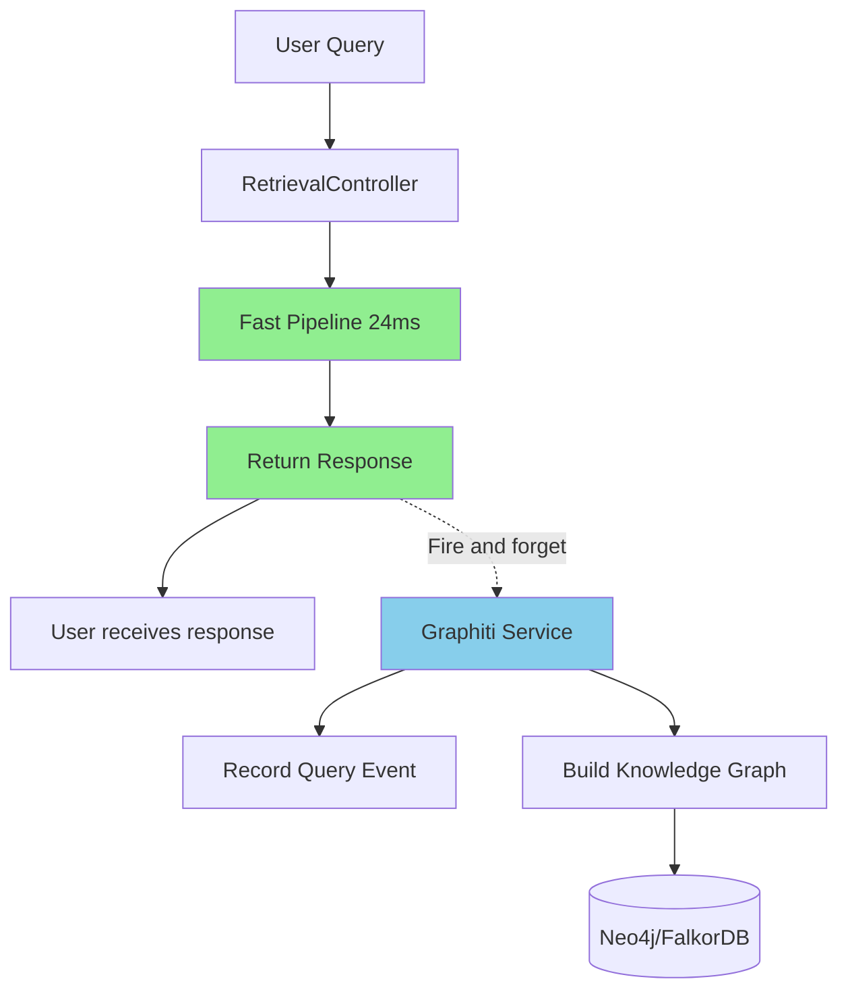
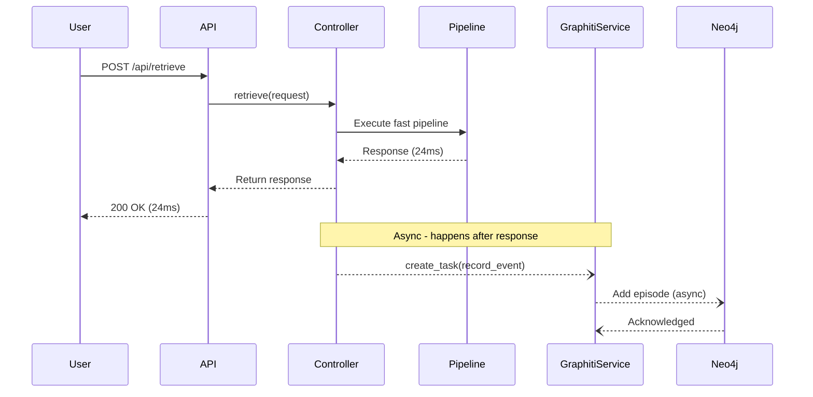

# Phase 1: Zero-Latency Graphiti Integration

## Architecture Overview

This implementation adds Graphiti as an **async learning layer** that records user interactions and builds a temporal knowledge graph without affecting retrieval latency. All Graphiti operations happen **after** the response is returned to the user.




## Implementation Steps

### 1. Install Dependencies

Add to `[requirements.txt](requirements.txt)`:

```txt
# Knowledge Graph
graphiti-core==0.28.1
neo4j==5.26.0
```

### 2. Configuration Updates

Add Graphiti settings to `[src/core/config.py](src/core/config.py)`:

```python
class Settings(BaseSettings):
    # ... existing settings ...
    
    # Graphiti settings
    GRAPHITI_ENABLED: bool = True
    GRAPHITI_NEO4J_URI: str = "bolt://localhost:7687"
    GRAPHITI_NEO4J_USER: str = "neo4j"
    GRAPHITI_NEO4J_PASSWORD: str = "password"
    OPENROUTER_API_KEY: str = ""  # For Graphiti's entity extraction via OpenRouter
    GRAPHITI_LLM_MODEL: str = "anthropic/claude-3.5-sonnet"  # OpenRouter model
    GRAPHITI_NAMESPACE: str = "ad_retrieval"
```

Add to `[.env](.env)`:

```env
GRAPHITI_ENABLED=true
GRAPHITI_NEO4J_URI=bolt://localhost:7687
GRAPHITI_NEO4J_USER=neo4j
GRAPHITI_NEO4J_PASSWORD=your_password
OPENROUTER_API_KEY=your_openrouter_key
GRAPHITI_LLM_MODEL=anthropic/claude-3.5-sonnet
GRAPHITI_NAMESPACE=ad_retrieval
```

### 3. Create Graphiti Service

Create new file `src/services/graphiti_service.py`:

**Key Features:**

- Async event recording (fire-and-forget pattern)
- Records query events with context
- Tracks campaign impressions
- Builds temporal knowledge graph
- No impact on retrieval latency

**Event Types to Record:**

1. **Query Events**: User query + context + eligibility + categories
2. **Campaign Impressions**: Which campaigns were shown
3. **User Journey**: Sequential queries from same user/session

**Implementation Pattern:**

```python
class GraphitiService:
    async def record_query_event(
        self, 
        query: str, 
        context: dict, 
        eligibility: float,
        categories: list,
        campaigns: list
    ):
        # Build episode text describing the event
        episode = self._build_episode(query, context, eligibility, categories, campaigns)
        
        # Add to Graphiti (async, non-blocking)
        await self.graphiti_client.add_episode(
            name=f"query_{timestamp}",
            episode_body=episode,
            source_description="Ad Retrieval Query"
        )
```

### 4. Create Graphiti Repository

Create new file `src/repositories/graphiti_repository.py`:

**Responsibilities:**

- Initialize Graphiti client with OpenRouter LLM configuration
- Manage Neo4j connection
- Handle episode creation
- Provide query interface for analytics

**Key Methods:**

- `initialize()`: Setup Graphiti client with OpenRouter LLM and Neo4j connection
- `add_episode()`: Record event to knowledge graph
- `get_user_journey()`: Retrieve user's query history (for future use)
- `get_campaign_relationships()`: Query campaign co-occurrence patterns
- `shutdown()`: Cleanup connections

**OpenRouter Configuration:**

Graphiti supports custom LLM providers. Configure it to use OpenRouter by setting the base URL and API key:

```python
from graphiti_core import Graphiti
from graphiti_core.llm_client import OpenAIClient

# Configure OpenRouter as LLM provider
llm_client = OpenAIClient(
    api_key=openrouter_api_key,
    base_url="https://openrouter.ai/api/v1",
    model=llm_model  # e.g., "anthropic/claude-3.5-sonnet"
)

graphiti = Graphiti(neo4j_uri, neo4j_user, neo4j_password, llm_client=llm_client)
```

### 5. Update Retrieval Controller

Modify `[src/controllers/retrieval_controller.py](src/controllers/retrieval_controller.py)`:

**Changes:**

- Inject `GraphitiService` as optional dependency
- After building response (line 172), fire async task to record event
- Use `asyncio.create_task()` for fire-and-forget pattern
- Wrap in try-except to prevent Graphiti errors from affecting retrieval

**Code Location:** After line 172, before `return RetrievalResponse`:

```python
# Fire-and-forget: Record to Graphiti (no latency impact)
if self.graphiti_service:
    asyncio.create_task(
        self._record_to_graphiti_safe(request, eligibility, categories, campaign_models)
    )

return RetrievalResponse(...)
```

Add helper method:

```python
async def _record_to_graphiti_safe(self, request, eligibility, categories, campaigns):
    try:
        await self.graphiti_service.record_query_event(
            query=request.query,
            context=context_dict,
            eligibility=eligibility,
            categories=categories,
            campaigns=campaigns[:10]  # Only record top 10 to reduce payload
        )
    except Exception as e:
        logger.warning(f"Graphiti recording failed (non-critical): {e}")
```

### 6. Update Dependency Injection

Modify `[src/core/dependencies.py](src/core/dependencies.py)`:

**Changes:**

- Add global `_graphiti_repo` variable
- Initialize `GraphitiRepository` in `init_dependencies()` (with try-except for optional setup)
- Add `GraphitiService` to controller initialization
- Handle graceful degradation if Graphiti is disabled or fails

**Pattern:**

```python
# Initialize Graphiti (optional - graceful degradation)
if settings.GRAPHITI_ENABLED:
    try:
        _graphiti_repo = GraphitiRepository(
            neo4j_uri=settings.GRAPHITI_NEO4J_URI,
            neo4j_user=settings.GRAPHITI_NEO4J_USER,
            neo4j_password=settings.GRAPHITI_NEO4J_PASSWORD,
            openrouter_api_key=settings.OPENROUTER_API_KEY,
            llm_model=settings.GRAPHITI_LLM_MODEL
        )
        await _graphiti_repo.initialize()
        logger.info("✓ Graphiti repository initialized (using OpenRouter)")
    except Exception as e:
        logger.warning(f"Graphiti initialization failed (optional): {e}")
        _graphiti_repo = None
```

### 7. Create Event Models

Create new file `src/api/models/events.py`:

**Purpose:** Define structured event models for Graphiti

**Models:**

- `QueryEvent`: Query + context + results metadata
- `CampaignImpression`: Campaign shown to user
- `UserSession`: Track session-level patterns

### 8. Add Analytics Endpoint (Optional)

Create new file `src/api/routes/analytics.py`:

**Endpoints:**

- `GET /api/analytics/user-journey`: Retrieve user's query history
- `GET /api/analytics/campaign-relationships`: Get campaign co-occurrence data
- `GET /api/analytics/popular-categories`: Category trends over time

**Note:** These are read-only analytics endpoints with no latency constraints.

### 9. Testing Strategy

Create `tests/integration/test_graphiti_integration.py`:

**Test Cases:**

1. **Test async recording**: Verify events are recorded without blocking
2. **Test graceful degradation**: System works when Graphiti is disabled
3. **Test error handling**: Graphiti failures don't affect retrieval
4. **Test latency impact**: Confirm retrieval latency unchanged
5. **Test event structure**: Verify episode format is correct

**Benchmark Test:**

- Run benchmark before and after Graphiti integration
- Confirm P95 latency remains under 30ms
- Verify no increase in error rate

### 10. Documentation

Update `[README.md](README.md)`:

**Sections to add:**

- Graphiti integration overview
- Setup instructions for Neo4j
- Configuration options
- Analytics capabilities
- Future enhancement roadmap

Create `docs/GRAPHITI_INTEGRATION.md`:

**Contents:**

- Architecture diagram
- Event schema documentation
- Query examples for analytics
- Troubleshooting guide

## Data Flow




## Key Design Decisions

### Fire-and-Forget Pattern

Use `asyncio.create_task()` to record events asynchronously after response is sent. This ensures **zero latency impact** on retrieval.

### Graceful Degradation

If Graphiti is disabled or fails, the system continues to work normally. Graphiti is treated as an **optional enhancement**, not a critical dependency.

### Minimal Payload

Only record top 10 campaigns (not all 1000) to reduce Graphiti processing time and storage.

### Error Isolation

Wrap all Graphiti calls in try-except blocks. Log warnings but never propagate errors to the retrieval pipeline.

### Neo4j vs FalkorDB

Start with Neo4j (more mature, better docs). Can switch to FalkorDB later for better performance if needed.

### OpenRouter for LLM Calls

Use OpenRouter instead of OpenAI directly for Graphiti's entity extraction and relationship building. Benefits:

- Access to multiple models (Claude, GPT-4, Llama, etc.)
- Unified API and billing
- Cost optimization by choosing appropriate models
- Fallback options if one provider is down

Graphiti uses the OpenAI-compatible API, so OpenRouter works seamlessly by setting the base URL to `https://openrouter.ai/api/v1`.

## Success Metrics

1. **Zero Latency Impact**: P95 latency remains ≤30ms after integration
2. **Event Recording Rate**: >95% of queries successfully recorded
3. **System Stability**: No increase in error rate or crashes
4. **Knowledge Graph Growth**: Graph builds over time with meaningful relationships

## Future Enhancements (Phase 2+)

Once Phase 1 is stable, these become possible:

1. **Pre-computed Graph Features**: Nightly job queries Graphiti for campaign relationships, caches results
2. **User Journey Prediction**: Use graph patterns to predict next query
3. **Personalized Ranking**: Adjust ranking based on user's historical patterns
4. **A/B Testing Framework**: Track which ranking strategies work best
5. **Real-time Recommendations**: Separate endpoint with 200ms budget using live graph queries

## Structured Commit Strategy

Each commit will be self-contained with its own tests, following TDD principles where appropriate.

### Commit 1: Add Graphiti dependencies and configuration

**Files:**

- `requirements.txt` - Add graphiti-core, neo4j
- `src/core/config.py` - Add Graphiti settings
- `.env.example` - Document new environment variables

**Tests:**

- `tests/unit/test_config.py` - Verify Graphiti settings load correctly
- Test default values, environment variable overrides

**Commit Message:**

```
feat: add Graphiti configuration and dependencies

- Add graphiti-core==0.28.1 and neo4j==5.26.0 to requirements
- Add Graphiti settings to config (Neo4j URI, OpenRouter API key, LLM model)
- Add GRAPHITI_ENABLED flag for graceful degradation
- Document configuration in .env.example

Tests: Unit tests for configuration loading
```

### Commit 2: Create event models for Graphiti episodes

**Files:**

- `src/api/models/events.py` - QueryEvent, CampaignImpression, UserSession models

**Tests:**

- `tests/unit/test_event_models.py` - Test model validation, serialization
- Test required/optional fields, data types, edge cases

**Commit Message:**

```
feat: add event models for Graphiti knowledge graph

- Create QueryEvent model (query, context, eligibility, categories, campaigns)
- Create CampaignImpression model (campaign_id, position, relevance_score)
- Create UserSession model for tracking session patterns
- Add Pydantic validation and serialization

Tests: Unit tests for event model validation
```

### Commit 3: Create GraphitiRepository with OpenRouter integration

**Files:**

- `src/repositories/graphiti_repository.py` - Repository implementation

**Tests:**

- `tests/unit/test_graphiti_repository.py` - Mock Neo4j, test initialization
- `tests/integration/test_graphiti_repository_integration.py` - Real Neo4j connection tests
- Test OpenRouter LLM client configuration
- Test episode creation, error handling

**Commit Message:**

```
feat: implement GraphitiRepository with OpenRouter LLM

- Initialize Graphiti client with OpenRouter configuration
- Configure OpenRouter base URL and API key
- Implement add_episode, get_user_journey, get_campaign_relationships
- Add graceful error handling and connection management
- Support for Neo4j connection pooling

Tests: Unit tests with mocks, integration tests with test Neo4j instance
```

### Commit 4: Create GraphitiService for async event recording

**Files:**

- `src/services/graphiti_service.py` - Service implementation

**Tests:**

- `tests/unit/test_graphiti_service.py` - Mock repository, test event building
- Test episode text generation from events
- Test async recording logic
- Test error handling and logging

**Commit Message:**

```
feat: add GraphitiService for async event recording

- Implement record_query_event with fire-and-forget pattern
- Build structured episode text from query events
- Add campaign impression tracking (top 10 only)
- Include user context and metadata in episodes
- Add comprehensive error handling

Tests: Unit tests for event recording and episode building
```

### Commit 5: Update dependency injection with Graphiti

**Files:**

- `src/core/dependencies.py` - Add Graphiti initialization

**Tests:**

- `tests/unit/test_dependencies.py` - Test dependency initialization
- Test graceful degradation when Graphiti disabled
- Test error handling when Graphiti fails to initialize

**Commit Message:**

```
feat: integrate Graphiti into dependency injection system

- Add GraphitiRepository initialization in init_dependencies
- Create GraphitiService with repository injection
- Implement graceful degradation if GRAPHITI_ENABLED=false
- Handle initialization failures without breaking startup
- Add Graphiti status to get_dependencies_status

Tests: Unit tests for dependency initialization and graceful degradation
```

### Commit 6: Integrate Graphiti into RetrievalController

**Files:**

- `src/controllers/retrieval_controller.py` - Add fire-and-forget recording

**Tests:**

- `tests/integration/test_graphiti/test_retrieval_integration.py` - End-to-end tests
- Test async recording doesn't block response
- Test latency impact (should be 0ms)
- Test error isolation (Graphiti errors don't affect retrieval)

**Commit Message:**

```
feat: add fire-and-forget Graphiti recording to retrieval pipeline

- Inject GraphitiService into RetrievalController
- Record query events after response is built
- Use asyncio.create_task for zero-latency recording
- Wrap in try-except to isolate errors
- Add _record_to_graphiti_safe helper method

Tests: Integration tests confirming zero latency impact and error isolation
```

### Commit 7: Add analytics endpoints for knowledge graph queries

**Files:**

- `src/api/routes/analytics.py` - Analytics endpoints
- `src/api/main.py` - Register analytics router

**Tests:**

- `tests/integration/test_graphiti/test_analytics_endpoints.py` - API tests
- Test user journey retrieval
- Test campaign relationship queries
- Test popular categories endpoint

**Commit Message:**

```
feat: add analytics endpoints for Graphiti knowledge graph

- Add GET /api/analytics/user-journey endpoint
- Add GET /api/analytics/campaign-relationships endpoint
- Add GET /api/analytics/popular-categories endpoint
- Include query parameters for filtering and pagination
- Add proper error handling and response models

Tests: Integration tests for all analytics endpoints
```

### Commit 8: Add comprehensive integration tests

**Files:**

- `tests/integration/test_graphiti/test_graphiti_integration.py` - Full integration suite
- `tests/integration/test_graphiti/conftest.py` - Pytest fixtures for Neo4j

**Tests:**

- Test full pipeline with Graphiti enabled
- Test graceful degradation when disabled
- Test error scenarios (Neo4j down, OpenRouter errors)
- Test concurrent requests
- Benchmark latency impact

**Commit Message:**

```
test: add comprehensive Graphiti integration test suite

- Add full pipeline integration tests with Neo4j
- Test graceful degradation scenarios
- Test error handling (Neo4j down, API failures)
- Add concurrent request tests
- Verify zero latency impact with benchmarks
- Add pytest fixtures for Neo4j test database

Tests: 20+ integration test cases covering all scenarios
```

### Commit 9: Add documentation and examples

**Files:**

- `README.md` - Add Graphiti section
- `docs/GRAPHITI_INTEGRATION.md` - Detailed documentation
- `docs/graphiti_setup.md` - Setup guide
- `examples/graphiti_queries.py` - Example analytics queries

**Tests:**

- `tests/integration/test_graphiti/test_documentation_examples.py` - Verify examples work

**Commit Message:**

```
docs: add Graphiti integration documentation

- Update README with Graphiti overview
- Create detailed integration guide
- Add Neo4j setup instructions (Docker, local, cloud)
- Document OpenRouter configuration
- Add example analytics queries
- Include troubleshooting guide

Tests: Verify documentation examples execute correctly
```

## Test Module Structure

Create a dedicated test module for Graphiti:

```
tests/
├── unit/
│   ├── test_config.py                    # Config tests (Commit 1)
│   ├── test_event_models.py              # Event model tests (Commit 2)
│   ├── test_graphiti_repository.py       # Repository unit tests (Commit 3)
│   ├── test_graphiti_service.py          # Service unit tests (Commit 4)
│   └── test_dependencies.py              # Dependency injection tests (Commit 5)
│
├── integration/
│   └── test_graphiti/
│       ├── __init__.py
│       ├── conftest.py                   # Shared fixtures (Neo4j, mocks)
│       ├── test_graphiti_repository_integration.py  # Repository integration (Commit 3)
│       ├── test_retrieval_integration.py            # Controller integration (Commit 6)
│       ├── test_analytics_endpoints.py              # Analytics API tests (Commit 7)
│       ├── test_graphiti_integration.py             # Full suite (Commit 8)
│       ├── test_error_scenarios.py                  # Error handling tests (Commit 8)
│       ├── test_latency_impact.py                   # Benchmark tests (Commit 8)
│       └── test_documentation_examples.py           # Doc examples (Commit 9)
│
└── fixtures/
    └── graphiti_test_data.py             # Shared test data
```

## Test Coverage Requirements

Each commit must achieve:

- **Unit tests**: 90%+ coverage for new code
- **Integration tests**: Cover happy path + error scenarios
- **All tests pass**: No broken tests in any commit
- **Independent commits**: Each commit is deployable on its own

## Rollout Plan

1. **Development**: Implement on local with Docker Neo4j
2. **Testing**: Run integration tests + benchmark validation after each commit
3. **Staging**: Deploy with `GRAPHITI_ENABLED=false` initially
4. **Gradual Rollout**: Enable for 10% → 50% → 100% of traffic
5. **Monitor**: Track latency, error rates, graph growth
6. **Optimize**: Tune episode format, batch recording if needed

